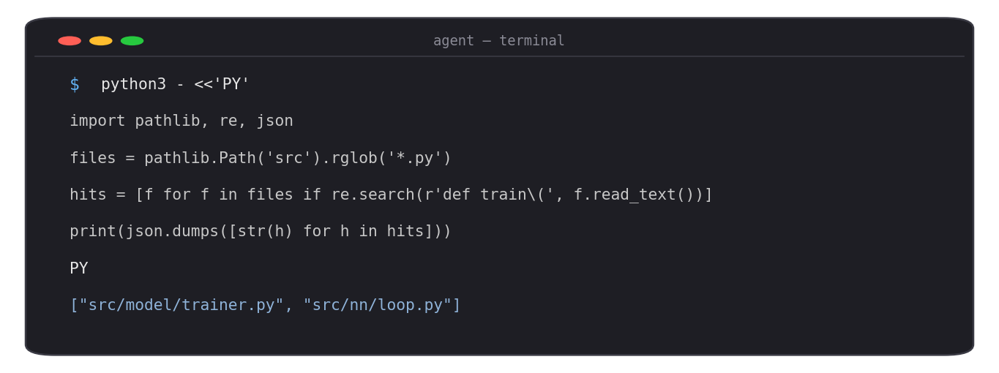
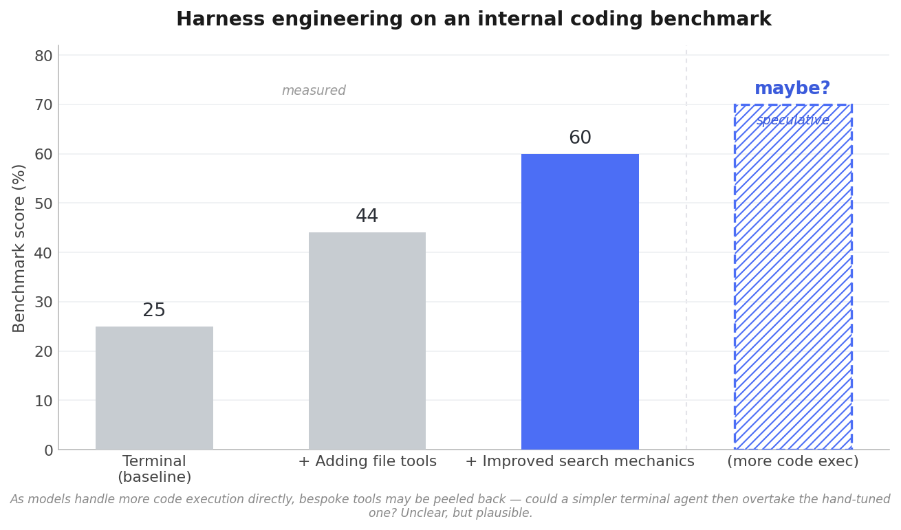
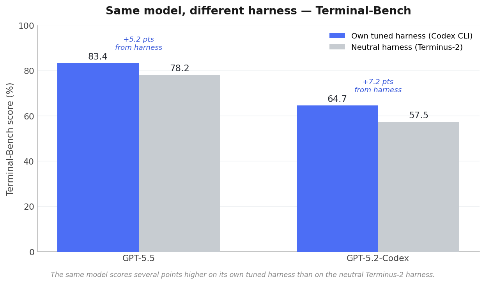
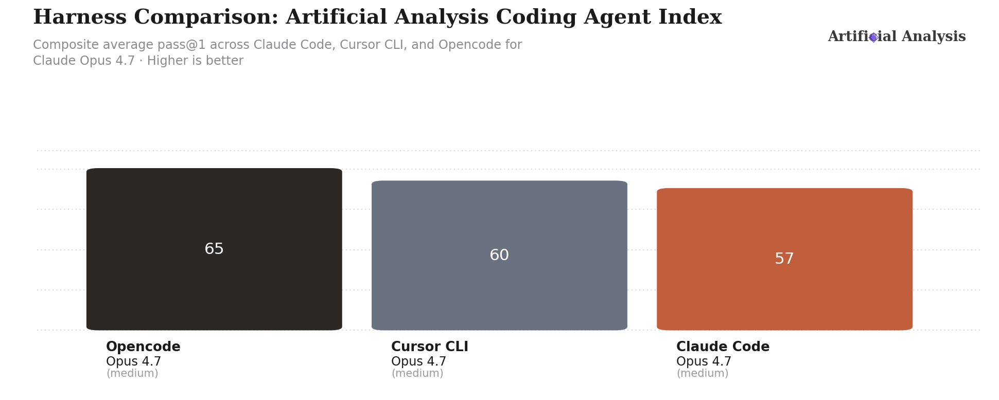

_I do a good chunk of research on coding agents and harnesses at NVIDIA. This is my take on where the design of these systems has been heading._

If you've used Claude Code, Codex, or OpenCode, you've used a _coding agent_: a model wrapped in a loop that lets it read files, run commands, and act on a repo. What's easy to miss is that almost all of these agents make the same core bet about _how_ the model acts — and that a quieter, more interesting bet lost, came back, and is now folding into the winner. This post is about that arc, and about the layer where I think most of the near-term gains actually live: the harness.

## Two schools: ReAct and CodeAct

Around 2023–2024, two styles of agent crystallized.

The first is **ReAct** — reason, then act — from ["ReAct: Synergizing Reasoning and Acting in Language Models"](https://arxiv.org/abs/2210.03629). The model thinks, then emits a _structured tool call_ ("open this file," "run this command"), gets a result back, and repeats. Every production coding agent today works this way: Claude Code, Codex, OpenCode, and the research harness I work on all reason-then-emit-a-tool-call in a loop.

The second is **CodeAct**, from ["Executable Code Actions Elicit Better LLM Agents"](https://arxiv.org/abs/2402.01030) (Xingyao Wang et al., ICML 2024). Instead of picking from a fixed menu of tools, the model _writes and runs actual code_ — usually Python in a live interpreter — as its action. The paper found this unified, code-native action space beat conventional tool-calling by up to ~20% on their benchmarks.

The distinction worth being precise about: a ReAct agent with a `bash` tool can obviously run code too. The real difference is what the _primary action surface_ is. In CodeAct, writing and running code is the interface itself, and the agent's own functions become its API. That's what makes it powerful — and, as it turns out, what made it hard to ride.

## The convergence — and the fold

Here's the plot twist. OpenHands is the flagship open-source agent built by the very author of CodeAct. And OpenHands itself [moved from a pure CodeAct design to function calling](https://www.openhands.dev/blog/openhands-codeact-21-an-open-state-of-the-art-software-development-agent) in its CodeAct 2.1 release — reporting that structured tool calls made runs smoother, resolved more issues without human intervention, and got the agent stuck in loops less often (it hit a state-of-the-art ~53% on SWE-bench Verified at the time). When the person who coined CodeAct ships the ReAct pattern, that tells you which way the training winds were blowing: frontier models were increasingly _post-trained_ for structured tool calling, so the harness that matched the model won.

But the story doesn't end at "ReAct won." The CodeAct _idea_ — code as a dense, composable action — is quietly folding back in, just through a simpler door. Instead of a full REPL-native harness, recent agents lean on a single **bash/terminal tool**, and a single command can carry arbitrarily rich code. The action surface collapses back toward "the model plus a shell."

You can see this most clearly in how minimal the winning harnesses have become:

- **mini-swe-agent** (from the SWE-bench / SWE-agent team) is [~100 lines of Python, bash-only, with _no_ tool-calling interface at all](https://github.com/SWE-agent/mini-swe-agent) — and still scores >74% on SWE-bench Verified. It doesn't even need the model's function-calling API; every action is just a bash command.
- **Terminus**, the reference agent for [Terminal-Bench](https://www.tbench.ai/news/terminus), is deliberately "an LLM plus a terminal" — a single tmux session as its only tool, no editing tools, no planner, no memory.

This is the "fold" I keep coming back to: the industry converged on ReAct, and now ReAct is absorbing what made CodeAct compelling by leaning on more code execution — treating the terminal (or a code sandbox) as the universal action. Models have gotten good enough at driving a shell that a huge amount of scaffolding just... evaporates. Someone literally titled a teaching harness ["Bash is all you need."](https://github.com/shareAI-lab/learn-claude-code)

It's telling that even the OpenHands founders frame it this way. When the CodeAct → tool-calling history came up, Graham Neubig pushed back on drawing too sharp a line — the terminal tool, he argues, is essentially _still_ CodeAct, because it gives the agent the ability to write and run code, which is the essence of CodeAct:

<blockquote class="twitter-tweet">
Thanks for the historical context! I slightly disagree on the interpretation though, I think the TerminalTool is essentially still CodeAct. It gives the agent the ability to write code and perform tasks which is the essence of CodeAct.
&mdash; Graham Neubig (@gneubig) <a href="https://x.com/gneubig/status/2061161541290864702?ref_src=twsrc%5Etfw">May 31, 2026</a></blockquote> 

Which is exactly the point: once ReAct's "run this command" tool becomes the primary action surface and the model starts writing real code into it, the ReAct/CodeAct distinction mostly dissolves.

You can watch this happen live. Point Codex at a task and it will often _write and run an ephemeral script_ rather than make a tidy sequence of tool calls — a `python3 - <<'PY' … PY` heredoc that greps the tree, filters, and prints an answer in one shot:

_Illustrative, but this is a real and widely-observed behavior:_ GPT/Codex frequently reach for Python (or `cat`, `node`, even Ruby) via the shell instead of a dedicated file-edit tool — to the point where people [debate how to stop it in `AGENTS.md`](https://github.com/openai/codex/discussions/3057). It's very likely a fingerprint of the RL environment these models were trained in, and it's the CodeAct idea leaking out of a plain terminal tool: one code action does the work of a dozen tool calls.

And it's not just coding agents. The same instinct — _let the model write code instead of chaining tool calls_ — is showing up across production systems. Perplexity moved search to ["Search as Code,"](https://www.perplexity.ai/hub/blog/sandbox-api-isolated-code-execution-for-ai-agents) where an agent writes Python against low-level search primitives in a sandbox instead of looping through one function call at a time, collapsing many round trips into a single program. Glean makes the same argument for enterprise agents with ["programmatic tool calling"](https://www.glean.com/blog/harness-context-manager): expose tools as Python-callable functions and let the model write a small program that retrieves, filters, loops, and acts in one execution, keeping intermediate state in variables and files rather than the prompt. Both are betting that code execution — not a long chain of discrete tool calls — is the natural action surface for agents. That's the fold generalizing well beyond the terminal.

Why is code the natural substrate? Because it's how you _compose_. Standard tool calling forces a model to do everything sequentially: call a tool, wait, read the result, decide the next call, repeat — one round trip at a time, with every intermediate result passing back through the context window. Code collapses that. A few lines can chain ten operations, branch on results, loop over a list, run independent calls in parallel, and keep bulky intermediate state in variables and files instead of the prompt. Tool chaining, fan-out/parallelism, map-reduce, retries — these are native to a programming language and awkward to express as a sequence of discrete tool calls. Today's models are trained to do this stepwise via tool calling; the trajectory is toward letting them express the same logic _as code_, in one shot. That's the real content of the ReAct↔CodeAct convergence: not "which syntax wins," but that the action surface is moving toward code because code is simply the better substrate for composition.

## The recipe is commoditized; the co-design isn't

Here's a claim that would have sounded wrong two years ago: building a _good_ coding agent is not that hard anymore. The recipe is well understood and increasingly public. A loop, a handful of tools (or just bash), a decent system prompt, some context management — mini-swe-agent proves you can get a strong one in ~100 lines. The barrier to a competent baseline agent has basically collapsed.

So if the agent is easy, where does the actual work go? Two places, and they're the whole game:

**Researching and building the harness for the specific model that powers it.** A harness is not model-agnostic in practice. The tools, prompts, and context strategy that make one model sing can actively hurt another — the compaction prompt, the tool descriptions, even how you format observations are all things that want to be tuned per model. The interesting work isn't "build an agent," it's "given _this_ model, engineer the harness around it until the pair is excellent," and then keep re-doing that as the model changes underneath you.

This isn't hand-waving; models have visibly different _personalities_ that the harness has to accommodate. GPT-in-Codex [tends to keep everything in a single main thread](https://knightli.com/en/2026/05/08/codex-vs-claude-code-subagent-design/), delegating explicitly and sparingly, while Claude leans hard on **subagents** — spinning up isolated, parallel workers — which is fair, since Anthropic largely popularized the pattern. Two strong models, two opposite default orchestration styles; a harness built around one can be actively wrong for the other. The effect is sharpest with smaller open models, which tend to be skewed toward the SWE / Python-repo tasks they were trained and evaluated on. Drop one into a _hardware_ codebase (RTL, verification, logs) and it can flail out of the box — but with the right harness engineering around it, no post-training required, you can often get it working. I wrote a bit more about that here:

<blockquote class="twitter-tweet">
You can tell a model is benchmaxxed on SWE when you ask it to do something in a GPU codebase and it starts looking for a README.md in the RTL 😭
&mdash; Ajay Mittur (@AjayMittur) <a href="https://x.com/AjayMittur/status/2061277025470710000?ref_src=twsrc%5Etfw">June 1, 2026</a></blockquote> 

This is exactly the observation the [Self-Harness](https://arxiv.org/abs/2606.09498) authors formalize: "effective harness design is inherently model-specific." Which is the whole point — if the right harness depends on the model, you have to own the harness to do the research at all.

**Co-designing the model and the harness together.** The tighter version of the above is to stop treating the model as fixed. The reason ReAct won production is precisely that frontier models were _post-trained_ for structured tool calling — the model was built for the harness. The biggest gains come from closing that loop deliberately: shape the harness around the model, and shape the model (via post-training on the harness's own traces) around the harness. Harness–model co-design, not harness _or_ model.

And this loop is a _ratchet_, which is the part I most want to get across. You add scaffolding to compensate for what the model can't yet do — a search tool, a planning step, a verification loop. Then you post-train the model on that harness's traces, and the model _internalizes the behavior_: it learns to do natively what the scaffolding was doing for it. Once it has, you can delete that piece of the harness — the model now handles it itself — which leaves a simpler harness, a stronger model, and room to post-train against the next layer. Scaffold, absorb, strip, repeat. So when I say "the model is eating the scaffolding" — a phrase I'm borrowing from Nicolas Bustamante's ["LLMs Eat Scaffolding for Breakfast"](https://www.nicolasbustamante.com/blog/llms-eat-scaffolding) — I don't just mean models get better in general; I mean post-training _with the harness_ is the mechanism that pulls harness behavior into the weights and lets you keep chipping the harness down. Bustamante's example is vivid: Codex's system prompt shrank from 310 lines to 104 (a 66% cut) from GPT-o3 to GPT-5, because the newer model already knew the behavior the old prompt had to spell out. Each turn of the ratchet leaves the model doing more and the harness doing less.

Both of these are only possible if you **own your harness**. You can't co-design against an interface you don't control, and you can't research per-model harness behavior if the agent loop, compaction, and tool dispatch are someone else's compiled binary. This is the real argument for building your own harness rather than only consuming an off-the-shelf one: not that off-the-shelf agents are bad (they're excellent), but that owning the harness is what turns "using an agent" into "researching agents." The next two sections are what that ownership buys you — first by hand, then automatically.

## Where the gains actually live: the harness

The fold can make it sound like the harness is vanishing. It isn't — it's getting smaller and higher-leverage at the same time; the leverage just relocated from _how many tools_ to _how well you feed and steer the model_. LangChain frames the anatomy cleanly: [an agent is a model _plus a harness_](https://www.langchain.com/blog/the-anatomy-of-an-agent-harness), and the harness is everything that isn't the model — tools, context management, feedback loops, orchestration. Even a "bash-only" agent has a harness; it's just a very good, very small one.

This is where owning the harness end to end pays off, and where I've spent most of my time. Here's an illustrative result on an internal coding benchmark — the same model throughout, only the harness changing:

The first three bars are measured. Starting from a plain terminal agent, two rounds of harness engineering — better ways for the agent to navigate and retrieve context, alongside continual prompt and context-management work — more than doubled the score, with no model change. It's not a coincidence that "install ripgrep" has become standard advice for coding agents: in a bash-native world, the harness's leverage moves to _how efficiently the agent can navigate and retrieve context_, not how many bespoke tools it has.

The clearest version of this shift is how coding agents largely _ditched RAG for grep_. The instinct a couple of years ago was to embed the whole repo into a vector database and retrieve chunks; the thing that actually won was letting the agent run keyword search — `grep`/`rg` — and read files like a developer would. The Claude Code team was blunt about it: agentic search outperformed embeddings-based retrieval "by a lot."

<blockquote class="twitter-tweet">
Boris from the Claude Code team explains why they ditched RAG for agentic discovery.   &quot;It outperformed everything. By a lot&quot; <a href="https://t.co/EzmpLeVixk">https://t.co/EzmpLeVixk</a> <a href="https://t.co/EFjhVNYX3A">pic.twitter.com/EFjhVNYX3A</a>
&mdash; pash (@pashmerepat) <a href="https://x.com/pashmerepat/status/1926717705660375463?ref_src=twsrc%5Etfw">May 25, 2025</a></blockquote> 

It's the same pattern as the CodeAct fold, one layer down: a heavier, bespoke subsystem (a vector index) gets replaced by the model driving a simple, general terminal primitive (search). Give a capable model good, fast, simple tools and let it navigate, rather than pre-chewing everything for it.

Now, back to that chart's fourth bar — the speculative one. It's a "maybe?", not a claim, and it points straight at a tension you may already feel: mini-swe-agent showed a strong enough model barely needs bespoke tooling, yet _this_ model, right now, got better when I added file and search tools. The fourth bar is my bet that the first fact eventually swallows the second. As models get better at driving a raw shell and doing more code execution directly — and especially as they're post-trained on this harness's own traces — it's plausible much of that bespoke tooling becomes unnecessary: you peel the engineered improvements back off, and a _simpler_ terminal agent could match or beat the carefully hand-tuned one. I don't know that it will, and I wouldn't bet a number on it. But if it does, the gains didn't vanish — they migrated out of your harness and into the model, exactly the ratchet from earlier. Either way, the lesson is to keep your harness thin enough to strip back.

This isn't just my anecdote. LangChain recently took their coding agent [from Top 30 to Top 5 on Terminal-Bench 2.0 — 52.8% to 66.5% — _without changing the model_](https://www.langchain.com/blog/improving-deep-agents-with-harness-engineering), purely through harness work: better system prompts with self-verification loops, environment-aware context injection, and middleware to catch failure patterns like doom loops. Same model, +14 points, from engineering the scaffolding. Their ["harness hill-climbing with evals"](https://www.langchain.com/blog/better-harness-a-recipe-for-harness-hill-climbing-with-evals) recipe is the disciplined version of that: source and tag evals, hold out a test set, baseline, read the traces, make one targeted harness change, re-measure. It's unglamorous, and it's most of the job. Owning the harness source is what makes that loop tight — you can instrument, mutate, and re-measure any layer instead of being boxed in by someone else's abstractions.

You can even see the harness effect _at the leaderboard level_. On [Terminal-Bench](https://www.tbench.ai/leaderboard/terminal-bench/2.1), the exact same model posts meaningfully different scores depending on the harness it's run under. Here, each model scores several points higher on its own tuned harness (Codex CLI) than on the neutral Terminus-2 harness everyone else is measured on:

That gap — 5 to 7 points here — is _pure harness_, no model change. It's also why cross-harness leaderboard comparisons are slippery: labs report their headline number on their own tuned harness, which flatters it, so it isn't directly comparable to a neutral-harness score. (Figures from public Terminal-Bench reporting and Anthropic's Opus 4.6 system card, via [this roundup](https://www.morphllm.com/comparisons/codex-vs-claude-code).)

It'd be tempting to reduce that to a tidy rule — "a model does best on its home harness." It's not that clean. [Artificial Analysis](https://artificialanalysis.ai/agents/coding-agents#harness-comparison) holds Claude Opus 4.7 constant across three harnesses — OpenCode, Cursor CLI, and Claude Code — on their composite Coding Agent Index, and the ranking flips:

Eight points of spread from the harness alone — but this time Anthropic's own Claude Code comes _last_ for Opus, behind OpenCode. Put the two charts side by side and the lesson isn't "own harness wins"; it's that harness choice swings the _same_ model by a lot, and _which_ harness is best is an empirical, model-specific question you can't predict from who built it. That's the whole reason you can't treat the harness as a fixed given — and why owning and tuning it is where the research actually is.

## Self-evolving harnesses: the loop closes

If the harness is this important, the natural next question is: can the agent improve its _own_ harness? That used to sound speculative — the early proof-of-concepts, like [ADAS](https://arxiv.org/abs/2408.08435) (a meta-agent programming new agents in code) and the [Darwin Gödel Machine](https://arxiv.org/abs/2505.22954) (an agent that rewrites its own code and took _itself_ from 20% to 50% on SWE-bench), are already a year or more old. It doesn't sound speculative anymore; the recent work makes it concrete, and it maps almost exactly onto the manual loop from the last section.

- **[Self-Harness](https://arxiv.org/abs/2606.09498)** (Zhang et al., 2026) automates precisely the hill-climbing loop I described: mine model-specific failure patterns from traces, propose minimal harness edits tied to those failures, accept them only after regression testing. Starting from a _minimal_ harness on Terminal-Bench-2.0, it lifted three different open models substantially — one from 40.5% to 61.9% held-out — with no human engineer and no stronger external agent in the loop.
- **[Harness-Aware Self-Evolving (HASE)](https://arxiv.org/abs/2607.03935)** (Luo et al., 2026) goes further and co-evolves the _model weights and the harness together_ in one RL process — the co-design thesis made literal. A single Qwen3-8B model under HASE matched a GPT-OSS-120B model that used Claude Code as its harness proposer.
- **[Recursive Language Models](https://arxiv.org/abs/2512.24601)** (Zhang, Kraska, Khattab; MIT CSAIL) let a model treat its own prompt as an environment it can decompose and recursively call itself over — restructuring its own scaffolding at run time, pushing effective context past millions of tokens while _improving_ quality.

Lilian Weng's recent survey, ["Harness Engineering for Self-Improvement,"](https://lilianweng.github.io/posts/2026-07-04-harness/) is a good map of this whole space if you want to go deeper.

The through-line: when your harness is code the agent can read and rewrite, self-improvement stops being bolted-on and becomes native. This is exactly why owning the harness matters so much. A third-party agent whose core is a compiled binary can't introspect and rewrite itself; a harness that's just readable, mutable source in the same process can. The manual hill-climbing loop from the last section — baseline, read traces, change the harness, re-measure — is precisely the loop Self-Harness and friends automate. Human-in-the-loop harness engineering and automated self-evolution aren't two different bets; they're the same loop at different levels of automation, and the hand-off between them is already happening.

## Where things are going

My read, stitched together:

The biggest bet I'd make is on **convergence**: ReAct and CodeAct are collapsing into one code-execution-centric style. Models and agents are becoming more and more code-native because **code is the better substrate for composition** — tool chaining, branching, parallel fan-out, map-reduce, retries — all the things models currently do stepwise, one tool call at a time, through the context window. The "won" pattern (ReAct tool calling) and the "lost" pattern (CodeAct) are meeting in the middle: a model that reasons, then _writes and runs code_ as its action. That's the direction I'd point at if you asked me where this is all going.

Everything else follows from that. The **ReAct tool-calling pattern won** the first production round because models were trained for it — that model–harness coupling is the thing to respect — but the **code-execution instinct is folding back in**, and not just for coding agents: search and enterprise agents are making the same move, and harnesses are getting radically smaller as models get better at writing and running code directly. **Building the agent got easy**, so the value moved — to researching the harness for your specific model, and ultimately to **co-designing the model and harness together**. That co-design is a _ratchet_: scaffold to cover a model's weakness, post-train on the harness's traces so the model absorbs that behavior, strip the now-redundant scaffolding, repeat — the model eats the scaffolding one layer at a time. The **harness is where you win or lose**, and its leverage keeps shifting: from clever tool menus, to context and search (RAG → grep), to eval-driven iteration, and now to letting the agent iterate on the harness itself. **Self-evolving harnesses aren't a someday-frontier** — agents are already rewriting their own code to real, measured gains; the manual and automated versions of harness engineering are converging into one loop.

The connective tissue through all of it is ownership. You can't co-design against a model, tune a harness per model, or let a harness rewrite itself if you don't own the harness in the first place. Off-the-shelf coding agents are great for getting work done. But if you want to _move the frontier_ rather than ride it, own your harness — engineer it, measure it, and increasingly, let it evolve itself.

If I had to compress it to one line: the model is eating the scaffolding, so the real work is co-designing the two — own a harness you can measure, rewrite, and eventually hand the pen to.

---

_Sources are linked inline. Views are my own. Opus 4.8 helped me refine my draft._
